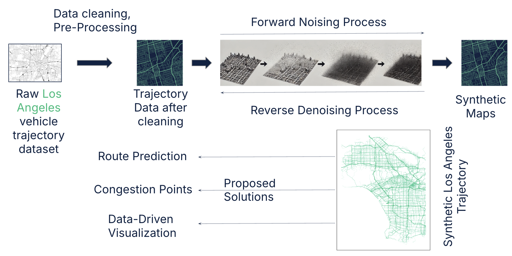
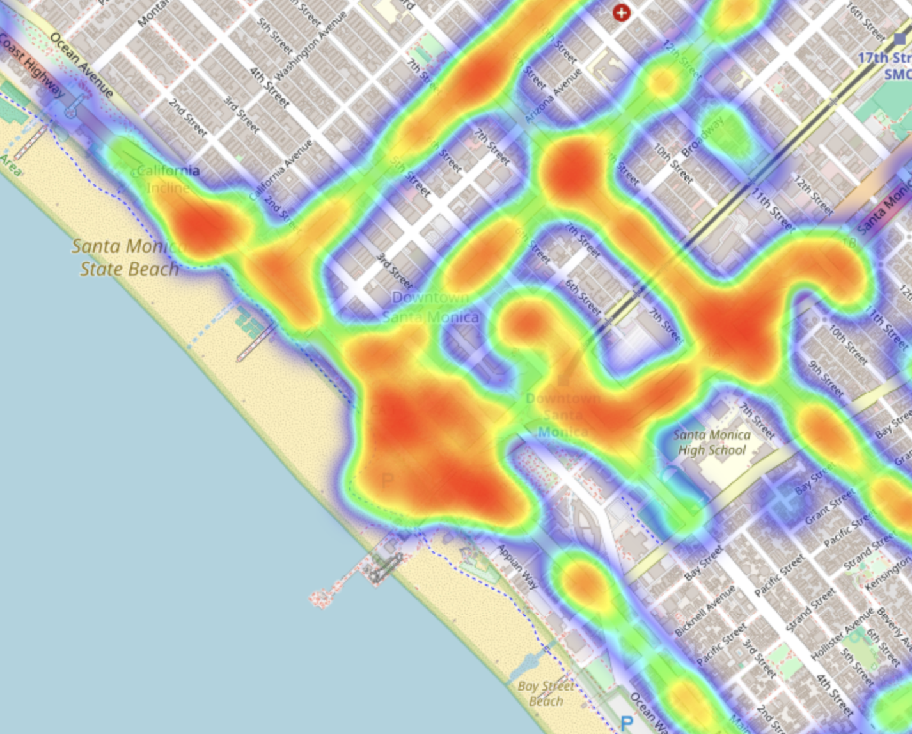
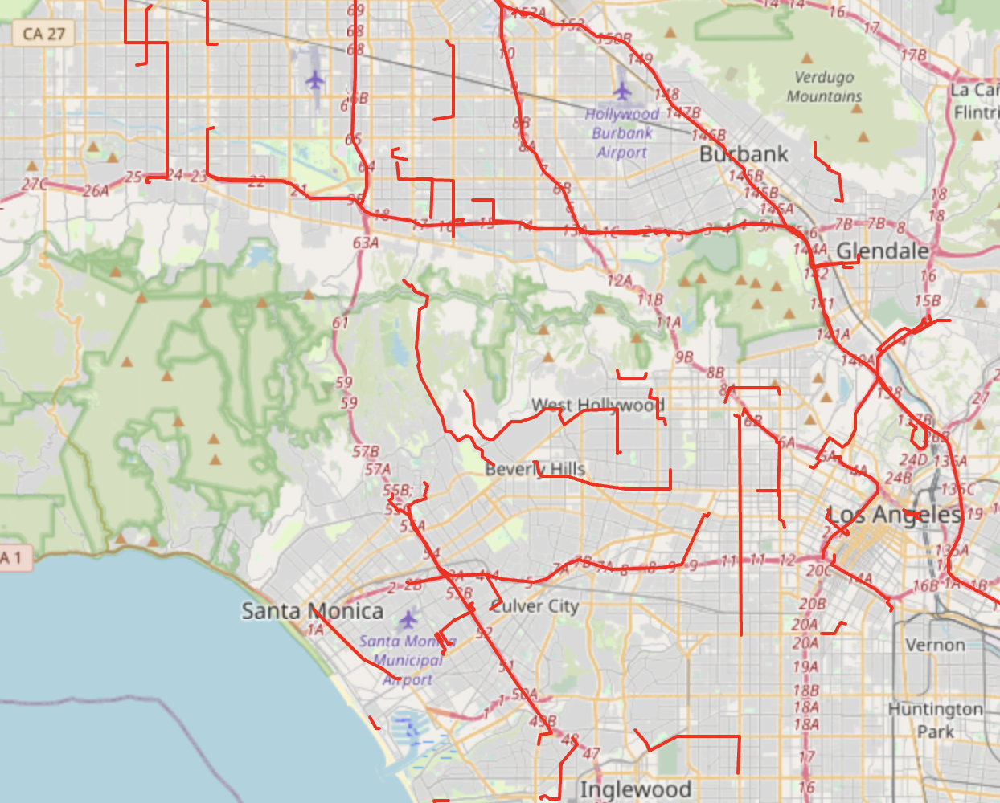
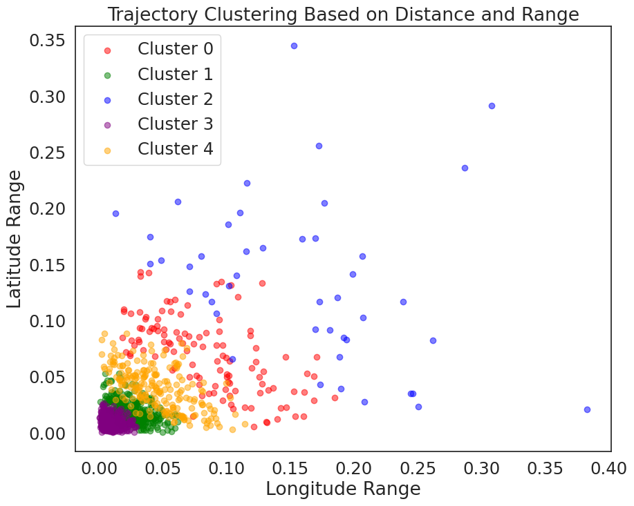
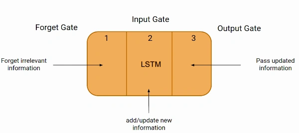
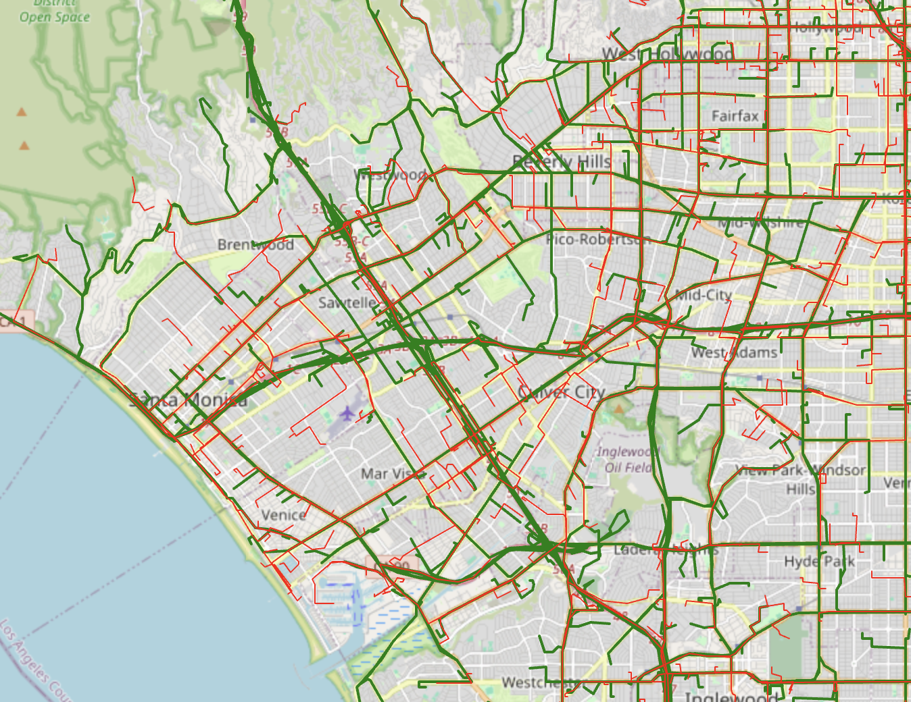

# SYNMOB-SMARTCITIES Project

## Project Overview

This project focuses on analyzing synthetic mobility data for smart city planning. It incorporates advanced data processing and visualization techniques to study traffic patterns, congestion points, and route optimizations.

## Framework Overview



Above is the architectural framework used in our project, illustrating the integration of various components such as data processing, model training, and visualization techniques.

## Results and Visualizations

Here are some of the key visualizations generated during our project:

### Heatmap of Traffic Congestion



This heatmap shows areas of high traffic congestion, helping in urban planning and traffic management.

### Route Prediction Visualization


This GIF illustrates the predictive modeling of vehicle routes using machine learning algorithms.

### Congestion Points Analysis



Identifies critical congestion points within the city to aid in traffic improvement measures.

### K-Means Clustering on Spatial Data



Visualization of traffic zones segmented using the K-means clustering algorithm.

### LSTM Model Visualization



Demonstration of the LSTM model used for predicting future traffic routes.

### Analysis of Short vs Long Distance Trips



Comparative analysis of short and long-distance trips within the city.

## Getting Started

To get a local copy up and running follow these simple steps:

```bash
git clone https://github.com/yourusername/your-project-name.git
cd your-project-name
# Further installation commands
